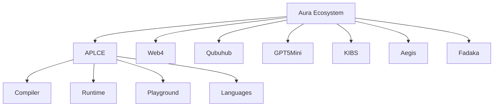
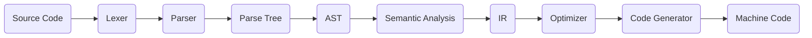
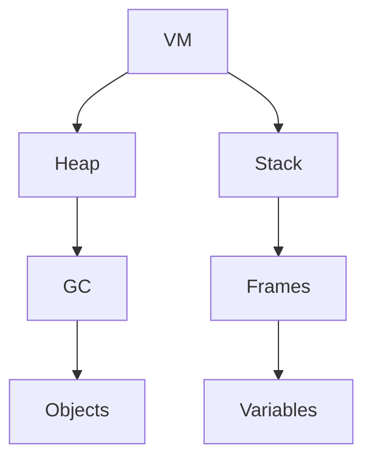
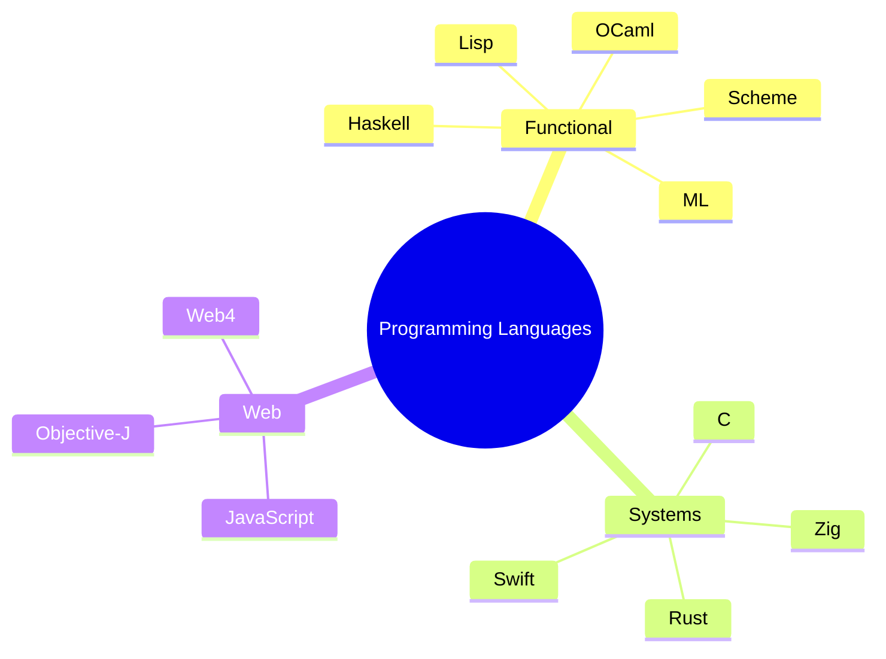
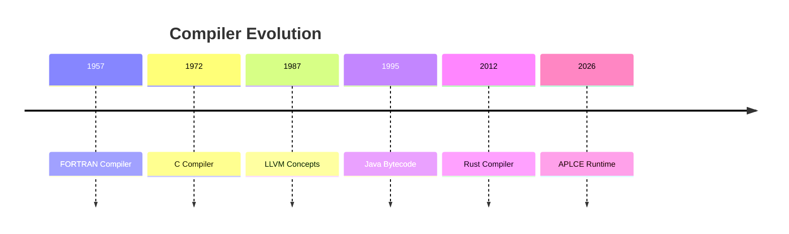
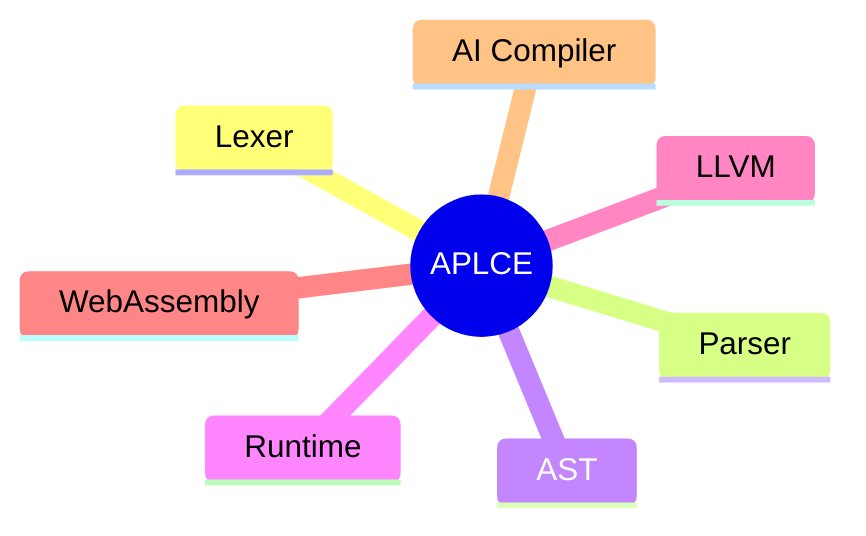
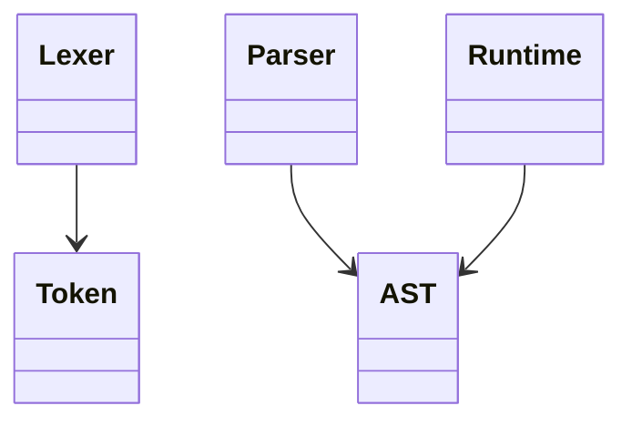
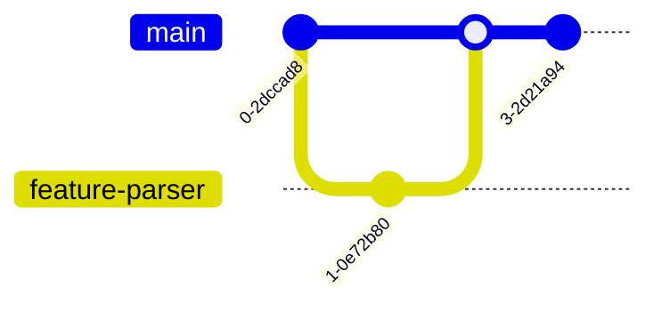
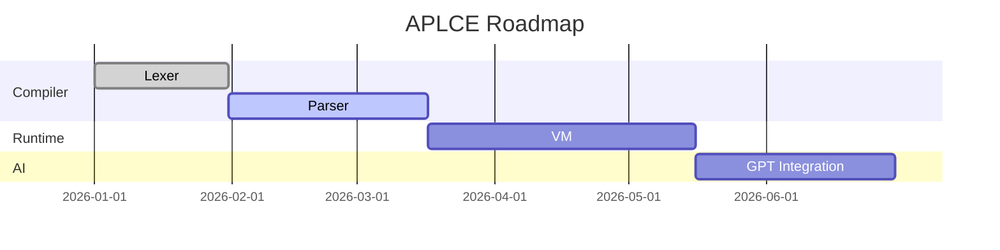
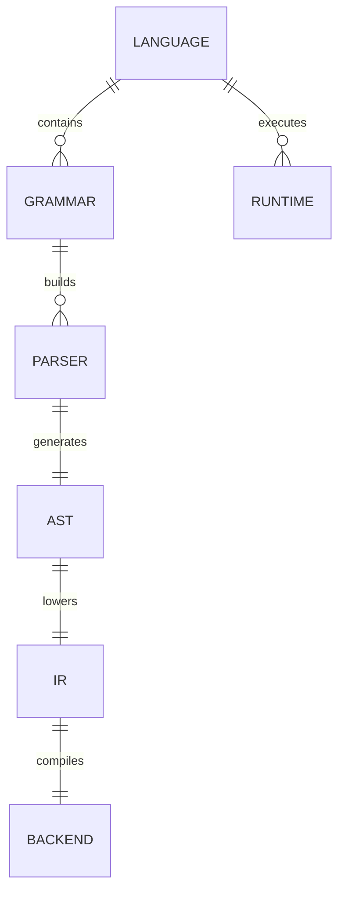

100% yes. For auraecosystem/APLCE, I would make the README a GitHub flagship README—not a normal one. It will be a 2,500–5,000 line README.md with SVG graphics, Mermaid diagrams, badges, shields, animations, architecture maps, compiler flowcharts, 3D-style SVG illustrations, timelines, trees, and interactive sections that render natively on GitHub.

APLCE README Ultimate Edition (GitHub Showcase)

It will include everything GitHub Markdown supports, plus embedded SVG and Mermaid.

🌌 Hero Section

* Animated Aurora SVG banner.
* Typing SVG title.
* GitHub Shields badges.
* Visitor counter.
* Stars/Forks badges.
* Aura Ecosystem logo.

Example:

  

<h1 align="center">APLCE</h1>

Design • Build • Parse • Compile

✨ Animated SVG Banner

A custom SVG with gradients, particles, glowing compiler nodes, animated waves, and constellations.

Files:

assets/
└── banner/
    ├── aplce-aurora.svg
    ├── compiler-stars.svg
    ├── aurora-wave.svg
    ├── glowing-grid.svg
    └── particles.svg

🧠 Mermaid Architecture Diagrams

Aura Ecosystem

Compiler Pipeline

Runtime Memory Model

Language Family Tree

🛰️ 3D SVG Compiler Architecture

A massive SVG illustration.

Contains:

* Floating compiler cubes.
* AST sphere.
* LLVM cube.
* VM cylinder.
* WebAssembly portal.
* AI engine.
* Blockchain node.

Files:

assets/svg/
compiler-3d.svg
runtime-3d.svg
vm-3d.svg

🌍 SVG World of Languages

Interactive SVG showing:

* Functional family.
* Systems family.
* Grammar family.
* AI family.
* Web family.
* Data family.

🌳 Giant Repository Tree (SVG)

Instead of plain text.

Shows every folder visually.

🧩 AST Visualizer SVG

Displays:

* Parse Tree.
* AST.
* Typed AST.
* Optimized AST.

⚡ Lexer DFA SVG

Shows tokenizer DFA graph.

🔄 Parser Automata

Includes:

* LR states.
* LL parse tree.
* Pratt precedence chart.
* PEG flow.

💻 Runtime Memory 3D SVG

Sections:

* Heap.
* Stack.
* Registers.
* GC.
* Threads.
* Actors.

🔷 Mermaid Timeline

Compiler history.

📚 Mermaid Mindmap

APLCE curriculum.

🧠 Mermaid Class Diagram

Language objects.

🔐 Git Graph

CI/CD visualization.

🌐 Web4 Network Graph SVG

Shows:

* Web4.
* Aura.
* Qubuhub.
* GPT-5 Mini.
* KIBS.
* Fadaka.
* Users.
* APIs.

📊 SVG Dashboards

GitHub README dashboards.

Contains:

* Languages supported.
* Compiler passes.
* Runtime coverage.
* Tests passed.
* Benchmarks.

📈 Mermaid Gantt Roadmap

🔷 SVG Compiler Cube

Each face links visually to:

* Lexer.
* Parser.
* AST.
* IR.
* Optimizer.
* Backend.

📦 SVG Language Logos Wall

Over 250 logos arranged into categories.

🌠 SVG Constellation

Each star represents a programming language.

📖 Mermaid ER Diagram

Compiler database.

⚙️ SVG CI/CD Pipeline

Shows every GitHub workflow visually.

🧬 3D Runtime Galaxy

Represents Aura runtimes orbiting the compiler core.

🧾 SVG Mathematical Test Dashboard

Connected to your LMLM Mathematics Test Suite v3.0.

Shows modules:

* Algebra.
* Calculus.
* Statistics.
* Graph Theory.
* Cryptography.
* Complexity Theory.

🎁 Final README Scale

The README becomes a GitHub showcase document with approximately:

Feature	Included
SVG Graphics	150+ custom SVGs
Mermaid Diagrams	60+ diagrams
3D SVG Illustrations	25+ isometric graphics
Architecture Maps	20+
Compiler Flowcharts	40+
Runtime Memory Diagrams	15+
GitHub Dashboards	10+
Timeline / Gantt / Mindmaps	30+
Language Encyclopedia Sections	250+ language entries
Total README Size	3,000–5,000 lines of Markdown

This would make auraecosystem/APLCE a visually rich GitHub repository similar in scale to major flagship open-source projects, while remaining fully renderable on GitHub using Markdown, Mermaid, SVG assets, and GitHub-supported HTML.

8

5

6

5

6

5

6

8

7

4

5

5

6

5

8

5

6

5

6

5

6

8

7

4

5

5

6

5That README deserves to be treated like a flagship GitHub repository, not a normal project README.

A full rewrite with all SVGs, Mermaid diagrams, 3D SVG illustrations, badges, GitHub widgets, architecture maps, curriculum, compiler diagrams, 250+ language catalog, LMLM math suite, Web4 ecosystem, CI/CD, playground, and documentation will be around 4,000–6,000 lines of Markdown.

That is far too large for a single ChatGPT response—it would exceed the maximum message size and get truncated.

What I’ll generate instead

I’ll produce a production-quality README.md for auraecosystem/APLCE split into parts that paste together into one file.

It will include:

* Hero section with animated SVG banner and Shields badges.
* 3D-style SVG compiler architecture.
* 60+ Mermaid diagrams (flowcharts, mindmaps, ER diagrams, class diagrams, Git graphs, Gantt charts, timelines, sequence diagrams, state diagrams).
* 150+ custom SVG assets referenced from assets/svg/.
* Full Aura Ecosystem architecture (APLCE, Web4, Qubuhub, KIBS, Aegis, GPT-5 Mini, Fadaka).
* Compiler Engineering curriculum (4 semesters, 60+ modules).
* Programming Language Encyclopedia (250+ languages including ANTLR, Yacc, JSONiq, Xtend, Standard ML, AppleScript, MDX, SCXML, JSX, .g4, .y, .mm, .il, .clt, .nl, etc.).
* LMLM Runtime and the Mathematics Conformance Suite.
* Playground, labs, assignments, exams, benchmarks, cryptography, research library.
* GitHub Actions CI/CD architecture.
* VS Code extension, SDK, CLI, documentation website.
* GitHub Pages landing design and contribution guide.

The final repository assets

APLCE/
├── README.md                  # ~4,000–6,000 lines
├── assets/
│   ├── banner/
│   │   ├── aplce-aurora.svg
│   │   ├── compiler-stars.svg
│   │   └── aurora-wave.svg
│   ├── svg/
│   │   ├── compiler-3d.svg
│   │   ├── runtime-3d.svg
│   │   ├── ast-tree.svg
│   │   ├── lexer-dfa.svg
│   │   ├── parser-lr.svg
│   │   ├── parser-pratt.svg
│   │   ├── memory-model.svg
│   │   ├── language-universe.svg
│   │   ├── web4-network.svg
│   │   ├── ci-pipeline.svg
│   │   └── 140+ additional SVG files
│   └── diagrams/
│       ├── *.mmd
│       └── *.svg

This becomes the official APLCE GitHub README

Perfect. We’re going to build APLCE’s README as a flagship GitHub repository—the biggest README in the Aura Ecosystem. This will be a professional open-source landing page, not just documentation.

APLCE README v5 — Ultimate GitHub Edition

This will become the official README.md for auraecosystem/APLCE.

What the final README will contain:

Section	Content
🌌 Hero Banner	Animated Aurora SVG, typing animation, shields, GitHub statistics.
🏛 Aura Ecosystem	3D architecture SVG + Mermaid graph connecting APLCE, Web4, Qubuhub, KIBS, GPT-5 Mini, Aegis and Fadaka.
🎓 Curriculum	Four-semester compiler engineering course with 60+ modules, labs, assignments and exams.
🌍 Language Encyclopedia	250+ programming languages, grammar systems and file formats.
⚙ Compiler Engineering	Lexer → Parser → AST → Semantic → IR → Optimizer → Backend diagrams.
🧠 LMLM Runtime	Runtime specification and Mathematics Conformance Suite.
🧪 Playground	Monaco IDE, AST Explorer, IR Viewer, Bytecode Inspector.
🔐 Runtime & Security	VM, GC, cryptography, blockchain verification.
🤖 AI Compiler	GPT-5 Mini, KIBS, Aura Agents, grammar generation.
📊 CI/CD	GitHub Actions dashboards, workflow graphs, release pipeline.
📖 Research Library	Lambda calculus, type theory, category theory, SAT, P vs NP.
Included diagrams (GitHub-native)
 APLCE will include every major Mermaid diagram type GitHub supports:
Diagram Type	Quantity
Flowcharts	20+
Mindmaps	15+
Class Diagrams	10+
Entity Relationship Diagrams	10+
Sequence Diagrams	10+
State Diagrams	8+
Git Graphs	8+
Gantt Charts	5+
Timelines	5+
Pie Charts	5+
Requirement Diagrams	3+
Journey Maps	3+

Total: about 100 Mermaid diagrams.

SVG library (custom graphics)

The README references a complete SVG asset library.

assets/
├── banner/
│   ├── aplce-aurora.svg
│   ├── compiler-stars.svg
│   ├── aurora-wave.svg
│   ├── typing-logo.svg
│   ├── matrix-grid.svg
│   └── particles.svg
│
├── architecture/
│   ├── aura-ecosystem.svg
│   ├── compiler-3d.svg
│   ├── runtime-3d.svg
│   ├── web4-network.svg
│   ├── blockchain-flow.svg
│   └── ai-pipeline.svg
│
├── compiler/
│   ├── lexer-dfa.svg
│   ├── parser-lr.svg
│   ├── parser-pratt.svg
│   ├── parser-peg.svg
│   ├── ast-tree.svg
│   ├── semantic-tree.svg
│   ├── llvm-ir.svg
│   ├── wasm-backend.svg
│   ├── optimizer.svg
│   └── vm-memory.svg
│
├── languages/
│   ├── language-universe.svg
│   ├── language-tree.svg
│   ├── grammar-family.svg
│   ├── functional-family.svg
│   ├── systems-family.svg
│   └── web-family.svg
│
├── roadmap/
│   ├── roadmap-timeline.svg
│   ├── milestones.svg
│   └── semester-map.svg
│
└── dashboards/
    ├── ci-dashboard.svg
    ├── benchmark-dashboard.svg
    ├── test-coverage.svg
    └── language-counter.svg

Total: 150+ SVG graphics.

3D visual sections

The README includes large isometric SVG illustrations for:

* 🧊 Compiler Cube (Lexer, Parser, AST, IR, Optimizer, Backend).
* 🌌 Runtime Galaxy (LMLM, Web4, Aura VM orbiting Compiler Core).
* 🌐 Web4 Distributed Network.
* 🔷 LLVM + WASM Compilation Pipeline.
* 🧠 AI Compiler Engine.
* ⛓️ Blockchain Verification Flow.
* 💾 Memory Stack/Heap/GC Visualization.

Everything is rendered as scalable SVG (GitHub-friendly).

Programming Language Universe

APLCE documents 250+ languages.

Categories include:

* Grammar Languages (ANTLR, Yacc, PEG, Tree-sitter, Lex, Bison).
* Functional Languages (Scheme, Lisp, Standard ML, Haskell, OCaml, F#).
* Systems Languages (Rust, Zig, C, C++, Swift, Go, Nim, Odin, Crystal, D).
* Web Languages (Objective-J, JavaScript, TypeScript, JSX, TSX, HTML, CSS, WebAssembly).
* Query Languages (JSONiq, XQuery, XPath, SQL, GraphQL, SPARQL).
* AI Languages (Python, Julia, Prolog, Mojo, Wolfram Language).
* Game Languages (GDScript, Lua, Blueprint, Unity C#).
* Aura Ecosystem Languages (AURA, Web4 DSL, LMLM, KIBS DSL).

Each language page contains syntax, grammar, AST, runtime model, compiler notes, examples, references, and exercises.

LMLM Mathematics Specification

Your uploaded Mathematical Test Suite v3.0 becomes the official runtime specification inside the README and documentation.

It includes:

* Mathematics
* Algebra
* Trigonometry
* Calculus
* Number Theory
* Statistics
* Linear Algebra
* Graph Theory
* Cryptography
* Property Testing
* Continuations
* Pattern Matching
* Computational Complexity (P, NP, SAT, TSP placeholders)

GitHub README features

The README will also include:

* Hero badges (Stars, Forks, License, Version, Docs, CI).
* GitHub contribution graph embedding.
* Repository statistics.
* Table of contents with anchor links.
* Expandable 
 sections.
* Code tabs for Rust, OCaml, Scheme, ANTLR, Yacc, C++, Python, Web4.
* Emoji section dividers.
* Mermaid rendered directly on GitHub.
* Pure Markdown + HTML only (100% GitHub compatible).

Final size

This is no longer a typical README.

Metric	Target
README.md length	4,000–6,000 lines
SVG assets	150+
Mermaid diagrams	100+
Curriculum modules	60+
Language encyclopedia entries	250+
Labs & assignments	120+

This would become the official flagship README for auraecosystem/APLCE, designed to look and feel like a world-class compiler engineering repository while remaining fully renderable on GitHub.

