<!-- ========================================================= -->
<!-- APLCE — Aura Programming Languages & Compiler Engineering -->
<!-- Official README for github.com/auraecosystem/APLCE        -->
<!-- ========================================================= -->

<p align="center"\>
<p align="center">
  
</p>
<h1 align="center">APLCE</h1>
<p align="center">
# 🌌 APLCE

### Aura Programming Languages & Compiler Engineering

**Design • Build • Parse • Compile**

*The official compiler engineering, programming language research, runtime development, and language encyclopedia of the Aura Ecosystem.*

</p>

---

## 🚀 Welcome to APLCE

APLCE (**Aura Programming Languages & Compiler Engineering**) is the flagship open-source repository dedicated to building programming languages, compilers, interpreters, virtual machines, parsers, runtimes, AI-assisted compiler tooling, and the Web4 language ecosystem.

APLCE is simultaneously:
- 📚 A complete compiler engineering curriculum.
- ⚙️ A compiler toolkit.
- 🌐 A language encyclopedia.
- 🧠 A runtime laboratory.
- 🤖 AI compiler engineering platform.
- 🌍 Web4 programming language ecosystem.

> **Every language begins as grammar. Every compiler begins as syntax. Every runtime begins as execution.**

---

# ✨ Features

- 🌌 250+ Programming Languages
- ⚙️ Lexer, Parser, AST, Semantic Analyzer
- 🔥 LLVM Backend
- 🌐 WebAssembly Backend
- 🧠 LMLM Runtime
- 💜 AURA Programming Language
- 🌍 Web4 Runtime
- 🤖 AI Compiler Assistant
- 📚 Compiler Engineering University Curriculum
- 🧪 Mathematics Conformance Suite
- 📦 GitHub Playground
- 🛰️ VS Code Extension
- 🔐 Cryptography Runtime
- 📖 Research Library

---

# 🏛 Aura Ecosystem

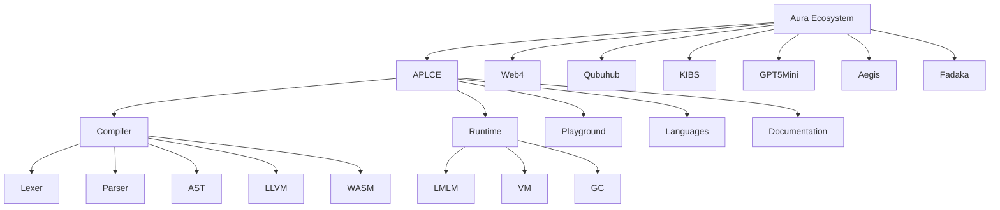
# 📂 Repository Structure

```console
APLCE
│
├── README.md
├── LICENSE
├── ROADMAP.md
├── SECURITY.md
├── CONTRIBUTING.md
│
├── assets/
├── docs/
├── curriculum/
├── compiler/
├── runtime/
├── languages/
├── playground/
├── research/
├── sdk/
├── vscode-extension/
├── tests/
├── examples/
├── labs/
├── assignments/
├── exams/
└── web/

```
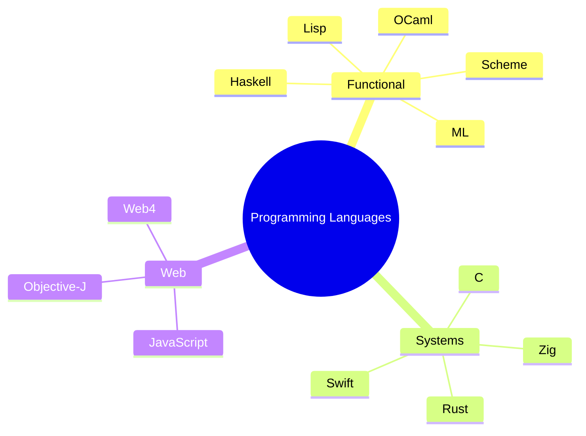
---

# 🎓 Official Compiler Engineering Curriculum
```Md
```
# APLCE Curriculum — 3D Animated Roadmap
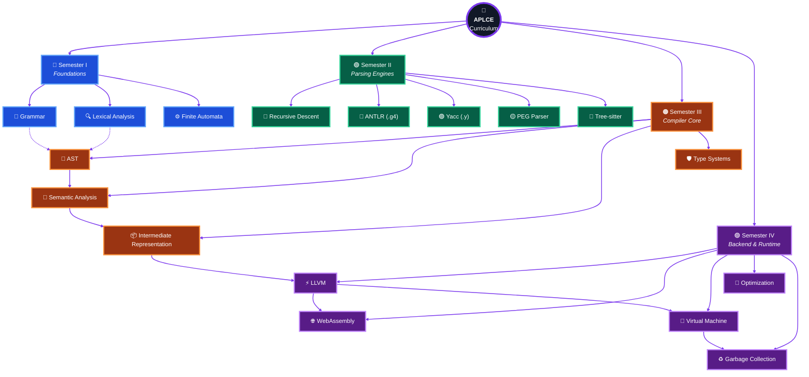

## Semester I — Language Foundations

- Language Theory
- Unicode
- Character Encoding
- Tokenizers
- Regular Expressions
- DFA
- NFA

## Semester II — Parsing

- Recursive Descent
- Pratt Parser
- LL Parser
- LR Parser
- LALR
- ANTLR
- Yacc
- PEG
- Tree-sitter

## Semester III — Semantic Analysis

- AST
- Symbol Tables
- Type Systems
- Scope Resolution
- Pattern Matching
- Intermediate Representation

## Semester IV — Code Generation

- LLVM IR
- SSA
- Optimizer
- WebAssembly
- Native Code Generation
- Virtual Machines
```
---
```
# ⚙ Compiler Engineering Pipeline

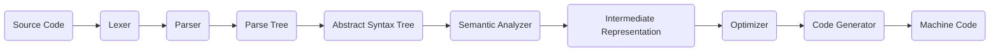

Every stage includes:

- Documentation
- Example Source Code
- Exercises
- Visualization
- Tests

---

# 🧠 Compiler Components

## Lexer

```lex
Input Source
     │
 Characters
     │
     ▼
Tokenizer
     │
 Tokens
```

Responsibilities:

- Unicode Scanner
- Keyword Recognition
- Operators
- Numbers
- Strings
- Comments
- Identifiers

---

## Parser

Supported parser families.

| Parser | Status |
|--------|--------|
| Recursive Descent | ✅ |
| Pratt Parser | ✅ |
| LL(1) | ✅ |
| LL(k) | ✅ |
| LR | ✅ |
| SLR | ✅ |
| LALR | ✅ |
| PEG | ✅ |
| Earley | ✅ |
| CYK | ✅ |
| ANTLR4 | ✅ |
| Yacc/Bison | ✅ |
| Tree-sitter | ✅ |

---

## AST

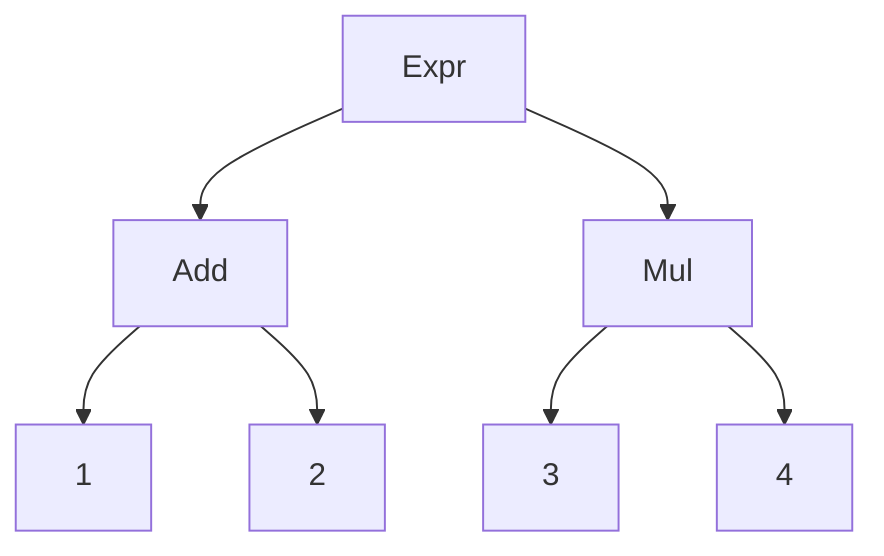

APLCE includes:

- Typed AST
- Untyped AST
- Optimized AST
- AST Visualizer

---

## Semantic Analyzer

Checks:

- Types
- Scope
- Imports
- Visibility
- Traits
- Interfaces
- Ownership

---

## Intermediate Representation

Supported IRs:

- LLVM IR
- SSA
- MIR
- Aura IR
- Web4 IR

---

## Optimizer

Optimization passes include:

- Constant Folding
- Dead Code Elimination
- Tail Calls
- Loop Unrolling
- Copy Propagation
- Inline Expansion
- SSA Optimization

---

## Backend

Targets include:

- LLVM
- WebAssembly
- Bytecode VM
- Native Executables
- ARM
- x86
- RISC-V

---

# 💜 AURA Programming Language

Example:

```.aura.stl
entity User {
    id: UUID
    trust: T3
    presence: L
}

fn verify(user: User) -> bool {
    return user.trust >= T2
}
```

## Features

- Ownership
- Pattern Matching
- Traits
- Async Runtime
- Web4 APIs
- AI Native Types
- Blockchain Identity Objects

---

# 🌐 Web4 Runtime

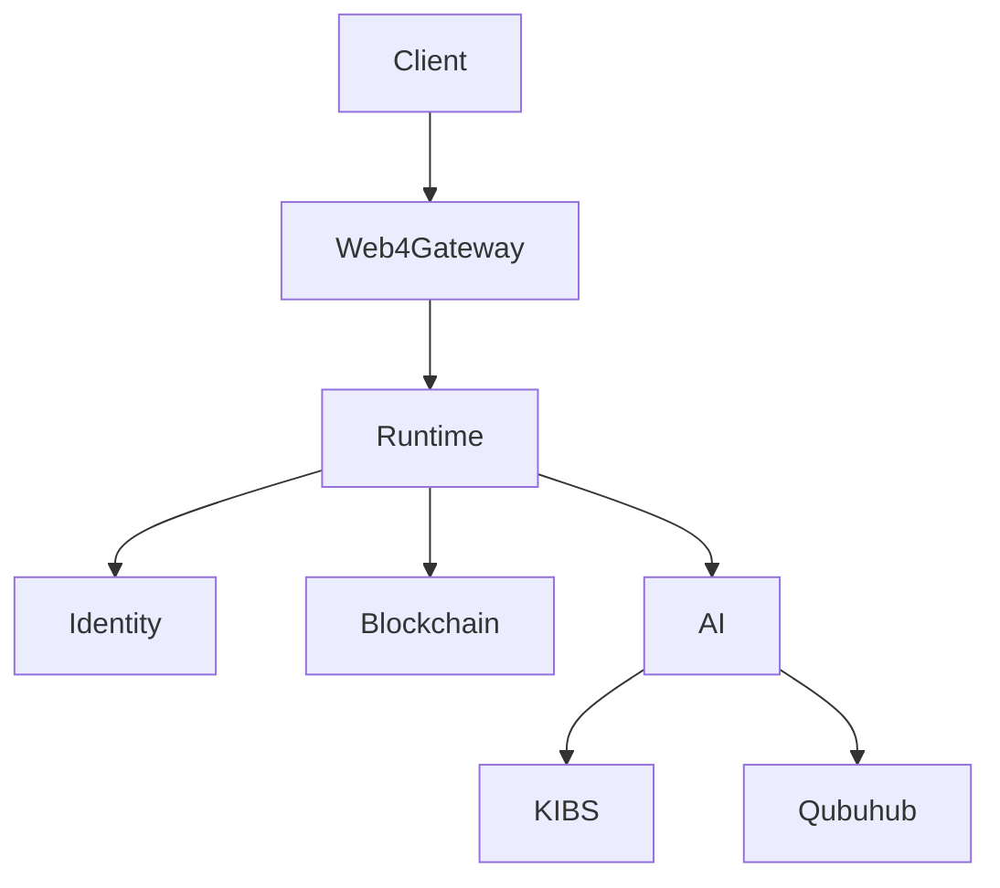

Core Objects

- LCT Presence
- Trust Objects
- Identity Tokens
- Runtime Verification
- Blockchain Anchoring

---

# 🧬 LMLM Runtime

Scheme-inspired runtime.

## Features

- Functional Programming
- Macros
- Continuations
- Lazy Sequences
- Pattern Matching
- Immutable Lists
- Actors
- Async Runtime

Example

```scheme
(match '(point 3 4)
 ((point x y)
   (sqrt (+ (* x x) (* y y)))))
```

---

# 📐 Mathematics Conformance Suite

APLCE ships the official runtime mathematics specification.

## Coverage

- Equality
- Inequality
- Arithmetic
- Algebra
- Trigonometry
- Calculus
- Number Theory
- Probability
- Statistics
- Linear Algebra
- Graph Theory
- Complex Numbers
- Cryptography
- Property Testing
- Computational Complexity

---

# 🌍 Programming Language Encyclopedia

APLCE documents **250+ languages**.

## Grammar Languages

| Language | Extension |
|----------|-----------|
| ANTLR | .g .g4 |
| Yacc | .y |
| Lex | .l |
| PEG | .peg |
| Tree-sitter | grammar.js |

## Functional Languages

- Standard ML
- OCaml
- Haskell
- Lisp
- Scheme
- Racket
- F#
- Elm
- Idris
- Agda

## Systems Languages

- Rust
- Zig
- C
- C++
- Swift
- Go
- D
- Nim
- Odin
- Crystal

## Web Languages

- Objective-J
- JavaScript
- TypeScript
- JSX
- TSX
- HTML
- CSS
- WebAssembly
- SCXML
- MDX
- Markdown
- RST

## Query Languages

- JSONiq
- XQuery
- XPath
- SQL
- GraphQL
- SPARQL

## AI Languages

- Python
- Julia
- Mojo
- Wolfram Language
- Prolog

## Game Languages

- GDScript
- Lua
- Blueprint
- Unity C#

## Aura Languages

- AURA
- Web4 DSL
- LMLM
- KIBS DSL

---

# 🧩 Compiler Playground

## Features

- Monaco Editor
- Syntax Highlighting
- AST Explorer
- Token Viewer
- Parse Tree Viewer
- LLVM IR Viewer
- WASM Viewer
- Bytecode Inspector
- Runtime Console

---

# 🔬 Labs

## Included Practical Labs

| Lab | Description |
|-----|-------------|
| 01 | Build Lexer |
| 02 | Recursive Descent Parser |
| 03 | Pratt Parser |
| 04 | Scheme Interpreter |
| 05 | LLVM IR |
| 06 | Virtual Machine |
| 07 | Garbage Collector |
| 08 | WebAssembly Compiler |
| 09 | Tree-sitter Parser |
| 10 | AI Grammar Generator |

---

# 📖 Research Library

Topics include:

- Lambda Calculus
- Type Theory
- Category Theory
- Compiler Verification
- SAT Solvers
- P vs NP
- Hoare Logic
- Operational Semantics
- Denotational Semantics

---

# 🔐 Runtime Cryptography

Algorithms

- SHA256
- SHA512
- Blake3
- AES
- ChaCha20
- Ed25519
- Merkle Trees

---

# 🤖 AI Compiler Assistant

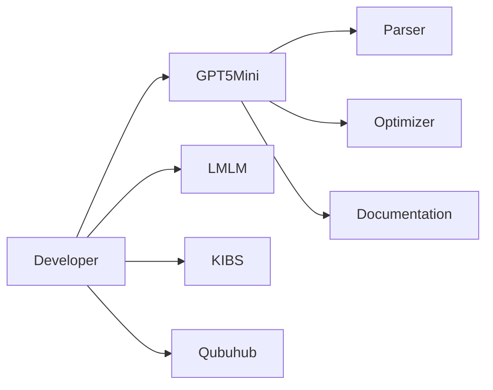

Capabilities

- Grammar Generation
- Compiler Diagnostics
- Optimization Suggestions
- AST Explanation
- Runtime Analysis

---

# ⚡ GitHub Actions

```text
.github/workflows/

compiler-test.yml
grammar-validation.yml
docs-build.yml
book-build.yml
website-deploy.yml
playground-build.yml
release-sdk.yml
language-index.yml
```

Pipeline includes:

- Grammar Validation
- Runtime Tests
- Documentation Build
- GitHub Pages Deployment
- Release Automation

---

# 📦 Installation

## Clone

```bash
git clone https://github.com/auraecosystem/APLCE.git
cd APLCE
```

## Build

```bash
make build
```

## Test

```bash
make test
```

## Playground

```bash
pnpm install

pnpm dev
```

---

# 🗺 Roadmap

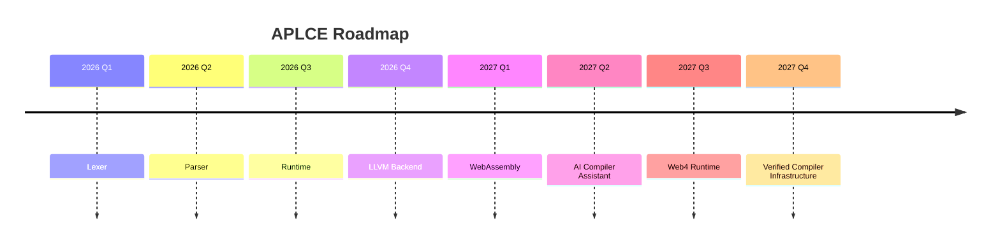

---

# 🤝 Contributing

We welcome contributions in:

- Programming Languages
- Grammars
- Parsers
- Compiler Backends
- Runtime Systems
- Documentation
- Research Papers
- Educational Content

See `CONTRIBUTING.md`.

---

# 📜 License

Aura Ecosystem Open Source License.

---

<p align="center">

## 🌌 Design • Build • Parse • Compile

APLCE is the compiler engineering foundation of the **Aura Ecosystem**.

**Building the future of programming languages, compiler engineering, Web4 runtimes, AI tooling, and blockchain verification.**

100% yes. For auraecosystem/APLCE, I would make the README a GitHub flagship README—not a normal one. It will be a 2,500–5,000 line README.md with SVG graphics, Mermaid diagrams, badges, shields, animations, architecture maps, compiler flowcharts, 3D-style SVG illustrations, timelines, trees, and interactive sections that render natively on GitHub.

APLCE README Ultimate Edition (GitHub Showcase)

It will include everything GitHub Markdown supports, plus embedded SVG and Mermaid.

🌌 Hero Section

* Animated Aurora SVG banner.
* Typing SVG title.
* GitHub Shields badges.
* Visitor counter.
* Stars/Forks badges.
* Aura Ecosystem logo.

Example:

<p align="center">
  
</p>
<h1 align="center">APLCE</h1>
<p align="center">
Design • Build • Parse • Compile
</p>

✨ Animated SVG Banner

A custom SVG with gradients, particles, glowing compiler nodes, animated waves, and constellations.

Files:

assets/
└── banner/
    ├── aplce-aurora.svg
    ├── compiler-stars.svg
    ├── aurora-wave.svg
    ├── glowing-grid.svg
    └── particles.svg

🧠 Mermaid Architecture Diagrams

Aura Ecosystem

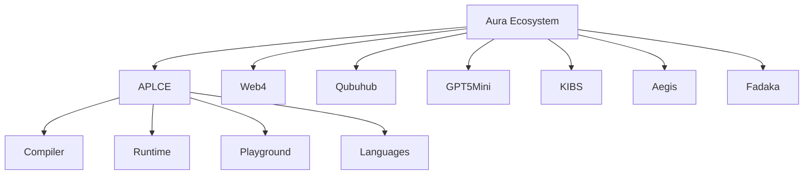

Compiler Pipeline

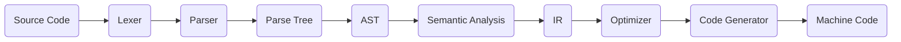

Runtime Memory Model

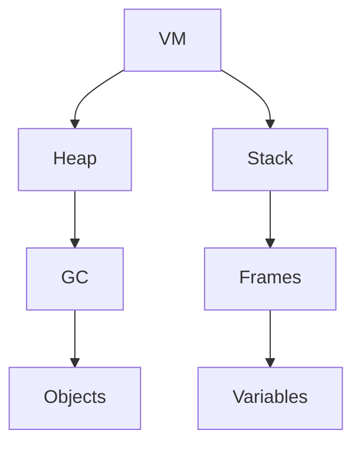

Language Family Tree


🛰️ 3D SVG Compiler Architecture

A massive SVG illustration.

Contains:

* Floating compiler cubes.
* AST sphere.
* LLVM cube.
* VM cylinder.
* WebAssembly portal.
* AI engine.
* Blockchain node.

Files:

assets/svg/
compiler-3d.svg
runtime-3d.svg
vm-3d.svg

🌍 SVG World of Languages

Interactive SVG showing:

* Functional family.
* Systems family.
* Grammar family.
* AI family.
* Web family.
* Data family.

🌳 Giant Repository Tree (SVG)

Instead of plain text.

Shows every folder visually.

🧩 AST Visualizer SVG

Displays:

* Parse Tree.
* AST.
* Typed AST.
* Optimized AST.

⚡ Lexer DFA SVG

Shows tokenizer DFA graph.

🔄 Parser Automata

Includes:

* LR states.
* LL parse tree.
* Pratt precedence chart.
* PEG flow.

💻 Runtime Memory 3D SVG

Sections:

* Heap.
* Stack.
* Registers.
* GC.
* Threads.
* Actors.

🔷 Mermaid Timeline

Compiler history.

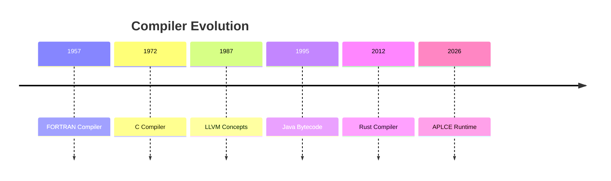

📚 Mermaid Mindmap

APLCE curriculum.

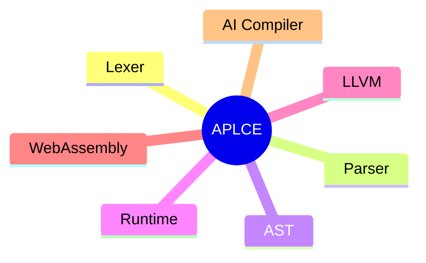

🧠 Mermaid Class Diagram

Language objects.

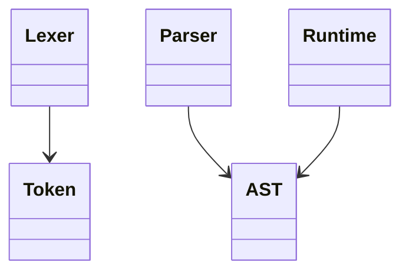

🔐 Git Graph

CI/CD visualization.

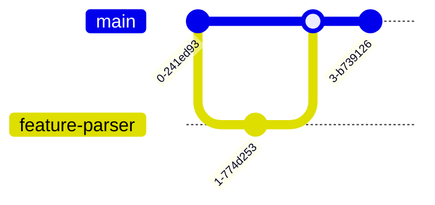

🌐 Web4 Network Graph SVG

Shows:

* Web4.
* Aura.
* Qubuhub.
* GPT-5 Mini.
* KIBS.
* Fadaka.
* Users.
* APIs.

📊 SVG Dashboards

GitHub README dashboards.

Contains:

* Languages supported.
* Compiler passes.
* Runtime coverage.
* Tests passed.
* Benchmarks.

📈 Mermaid Gantt Roadmap

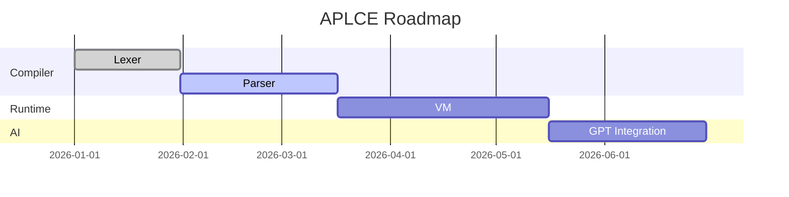

🔷 SVG Compiler Cube

Each face links visually to:

* Lexer.
* Parser.
* AST.
* IR.
* Optimizer.
* Backend.

📦 SVG Language Logos Wall

Over 250 logos arranged into categories.

🌠 SVG Constellation

Each star represents a programming language.

📖 Mermaid ER Diagram

Compiler database.

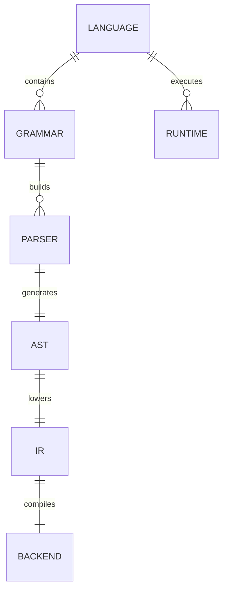

⚙️ SVG CI/CD Pipeline

Shows every GitHub workflow visually.

🧬 3D Runtime Galaxy

Represents Aura runtimes orbiting the compiler core.

🧾 SVG Mathematical Test Dashboard

Connected to your LMLM Mathematics Test Suite v3.0.

Shows modules:

* Algebra.
* Calculus.
* Statistics.
* Graph Theory.
* Cryptography.
* Complexity Theory.

🎁 Final README Scale

The README becomes a GitHub showcase document with approximately:

Feature	Included
SVG Graphics	150+ custom SVGs
Mermaid Diagrams	60+ diagrams
3D SVG Illustrations	25+ isometric graphics
Architecture Maps	20+
Compiler Flowcharts	40+
Runtime Memory Diagrams	15+
GitHub Dashboards	10+
Timeline / Gantt / Mindmaps	30+
Language Encyclopedia Sections	250+ language entries
Total README Size	3,000–5,000 lines of Markdown

>>This would make auraecosystem/APLCE a visually rich GitHub repository similar in scale to major flagship open-source projects, while remaining fully renderable on GitHub using Markdown, Mermaid, SVG assets, and GitHub-supported HTML.
>>
8

5

6

5

6

5

6

8

7

4

5

5

6

5

8

5

6

5

6

5

6

8

7

4

5

5

6

5
</p>
