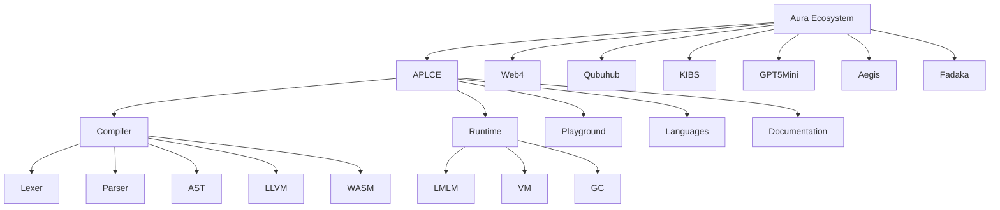
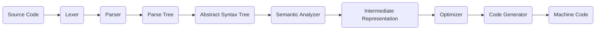
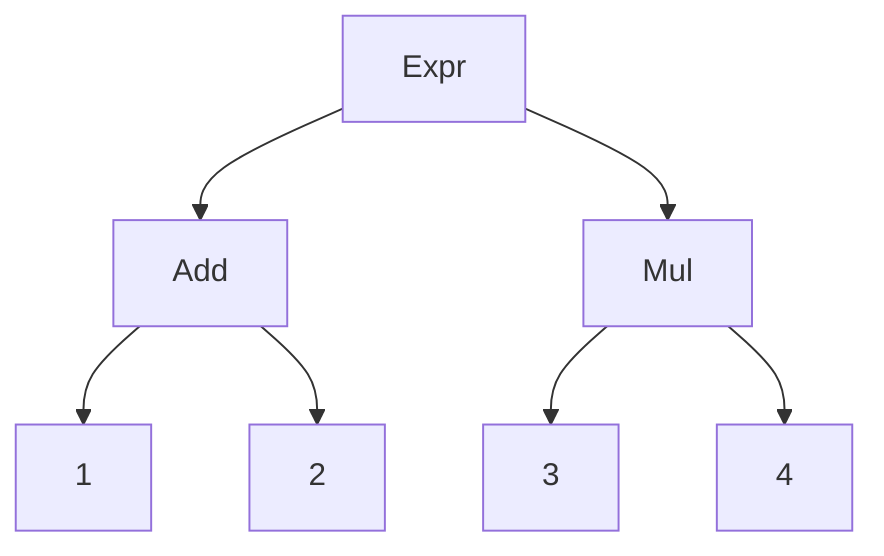
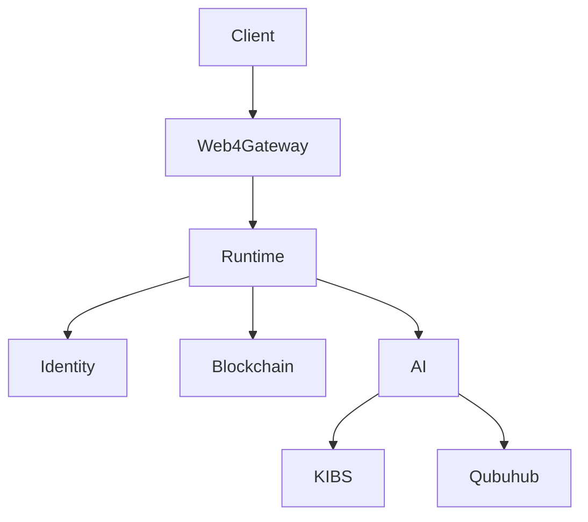
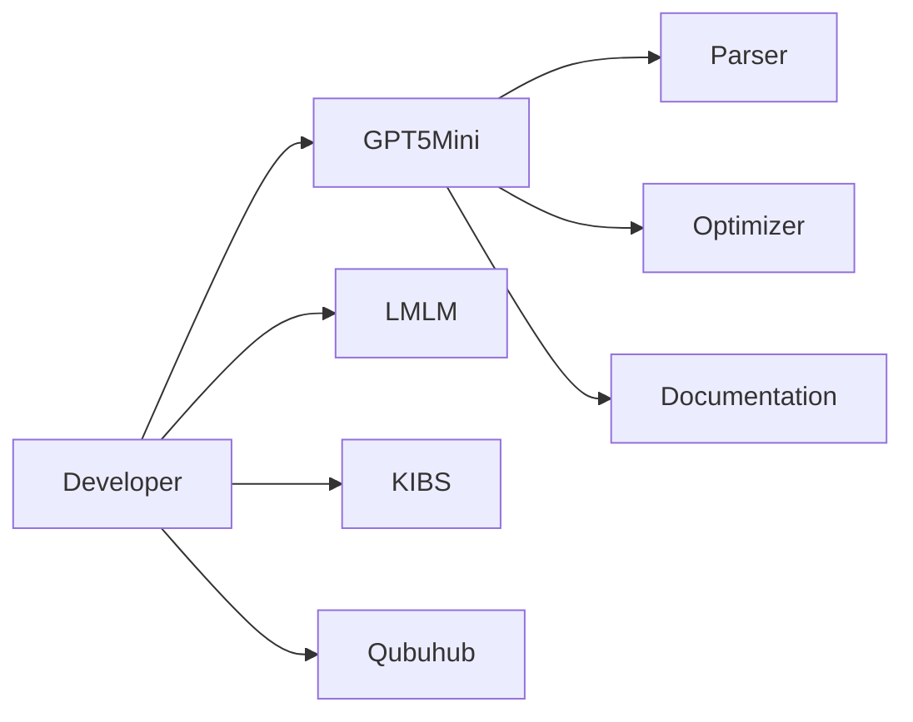
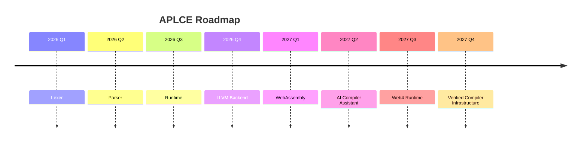

<!-- ========================================================= -->
<!-- APLCE — Aura Programming Languages & Compiler Engineering -->
<!-- Official README for github.com/auraecosystem/APLCE        -->
<!-- ========================================================= -->

<p align="center">

# 🌌 APLCE

### Aura Programming Languages & Compiler Engineering

**Design • Build • Parse • Compile**

*The official compiler engineering, programming language research, runtime development, and language encyclopedia of the Aura Ecosystem.*

</p>

---

## 🚀 Welcome to APLCE

APLCE (**Aura Programming Languages & Compiler Engineering**) is the flagship open-source repository dedicated to building programming languages, compilers, interpreters, virtual machines, parsers, runtimes, AI-assisted compiler tooling, and the Web4 language ecosystem.

APLCE is simultaneously:

- 📚 A complete compiler engineering curriculum.
- ⚙️ A compiler toolkit.
- 🌐 A language encyclopedia.
- 🧠 A runtime laboratory.
- 🤖 AI compiler engineering platform.
- 🌍 Web4 programming language ecosystem.

> **Every language begins as grammar. Every compiler begins as syntax. Every runtime begins as execution.**

---

# ✨ Features

- 🌌 250+ Programming Languages
- ⚙️ Lexer, Parser, AST, Semantic Analyzer
- 🔥 LLVM Backend
- 🌐 WebAssembly Backend
- 🧠 LMLM Runtime
- 💜 AURA Programming Language
- 🌍 Web4 Runtime
- 🤖 AI Compiler Assistant
- 📚 Compiler Engineering University Curriculum
- 🧪 Mathematics Conformance Suite
- 📦 GitHub Playground
- 🛰️ VS Code Extension
- 🔐 Cryptography Runtime
- 📖 Research Library

---

# 🏛 Aura Ecosystem



APLCE is the compiler engineering foundation of the Aura Ecosystem.

---

# 📂 Repository Structure

```text
APLCE
│
├── README.md
├── LICENSE
├── ROADMAP.md
├── SECURITY.md
├── CONTRIBUTING.md
│
├── assets/
├── docs/
├── curriculum/
├── compiler/
├── runtime/
├── languages/
├── playground/
├── research/
├── sdk/
├── vscode-extension/
├── tests/
├── examples/
├── labs/
├── assignments/
├── exams/
└── web/
```

---

# 🎓 Official Compiler Engineering Curriculum

```mermaid
mindmap
root((APLCE Curriculum))

Semester I
Grammar
Lexical Analysis
Finite Automata

Semester II
Recursive Descent
ANTLR
Yacc
PEG
Tree-sitter

Semester III
AST
Semantic Analysis
IR
Type Systems

Semester IV
LLVM
WebAssembly
Virtual Machine
Optimization
Garbage Collection
```

## Semester I — Language Foundations

- Language Theory
- Unicode
- Character Encoding
- Tokenizers
- Regular Expressions
- DFA
- NFA

## Semester II — Parsing

- Recursive Descent
- Pratt Parser
- LL Parser
- LR Parser
- LALR
- ANTLR
- Yacc
- PEG
- Tree-sitter

## Semester III — Semantic Analysis

- AST
- Symbol Tables
- Type Systems
- Scope Resolution
- Pattern Matching
- Intermediate Representation

## Semester IV — Code Generation

- LLVM IR
- SSA
- Optimizer
- WebAssembly
- Native Code Generation
- Virtual Machines

---

# ⚙ Compiler Engineering Pipeline



Every stage includes:

- Documentation
- Example Source Code
- Exercises
- Visualization
- Tests

---

# 🧠 Compiler Components

## Lexer

```text
Input Source
     │
 Characters
     │
     ▼
Tokenizer
     │
 Tokens
```

Responsibilities:

- Unicode Scanner
- Keyword Recognition
- Operators
- Numbers
- Strings
- Comments
- Identifiers

---

## Parser

Supported parser families.

| Parser | Status |
|--------|--------|
| Recursive Descent | ✅ |
| Pratt Parser | ✅ |
| LL(1) | ✅ |
| LL(k) | ✅ |
| LR | ✅ |
| SLR | ✅ |
| LALR | ✅ |
| PEG | ✅ |
| Earley | ✅ |
| CYK | ✅ |
| ANTLR4 | ✅ |
| Yacc/Bison | ✅ |
| Tree-sitter | ✅ |

---

## AST



APLCE includes:

- Typed AST
- Untyped AST
- Optimized AST
- AST Visualizer

---

## Semantic Analyzer

Checks:

- Types
- Scope
- Imports
- Visibility
- Traits
- Interfaces
- Ownership

---

## Intermediate Representation

Supported IRs:

- LLVM IR
- SSA
- MIR
- Aura IR
- Web4 IR

---

## Optimizer

Optimization passes include:

- Constant Folding
- Dead Code Elimination
- Tail Calls
- Loop Unrolling
- Copy Propagation
- Inline Expansion
- SSA Optimization

---

## Backend

Targets include:

- LLVM
- WebAssembly
- Bytecode VM
- Native Executables
- ARM
- x86
- RISC-V

---

# 💜 AURA Programming Language

Example:

```aura
entity User {
    id: UUID
    trust: T3
    presence: LCT
}

fn verify(user: User) -> bool {
    return user.trust >= T2
}
```

## Features

- Ownership
- Pattern Matching
- Traits
- Async Runtime
- Web4 APIs
- AI Native Types
- Blockchain Identity Objects

---

# 🌐 Web4 Runtime



Core Objects

- LCT Presence
- Trust Objects
- Identity Tokens
- Runtime Verification
- Blockchain Anchoring

---

# 🧬 LMLM Runtime

Scheme-inspired runtime.

## Features

- Functional Programming
- Macros
- Continuations
- Lazy Sequences
- Pattern Matching
- Immutable Lists
- Actors
- Async Runtime

Example

```scheme
(match '(point 3 4)
 ((point x y)
   (sqrt (+ (* x x) (* y y)))))
```

---

# 📐 Mathematics Conformance Suite

APLCE ships the official runtime mathematics specification.

## Coverage

- Equality
- Inequality
- Arithmetic
- Algebra
- Trigonometry
- Calculus
- Number Theory
- Probability
- Statistics
- Linear Algebra
- Graph Theory
- Complex Numbers
- Cryptography
- Property Testing
- Computational Complexity

---

# 🌍 Programming Language Encyclopedia

APLCE documents **250+ languages**.

## Grammar Languages

| Language | Extension |
|----------|-----------|
| ANTLR | .g .g4 |
| Yacc | .y |
| Lex | .l |
| PEG | .peg |
| Tree-sitter | grammar.js |

## Functional Languages

- Standard ML
- OCaml
- Haskell
- Lisp
- Scheme
- Racket
- F#
- Elm
- Idris
- Agda

## Systems Languages

- Rust
- Zig
- C
- C++
- Swift
- Go
- D
- Nim
- Odin
- Crystal

## Web Languages

- Objective-J
- JavaScript
- TypeScript
- JSX
- TSX
- HTML
- CSS
- WebAssembly
- SCXML
- MDX
- Markdown
- RST

## Query Languages

- JSONiq
- XQuery
- XPath
- SQL
- GraphQL
- SPARQL

## AI Languages

- Python
- Julia
- Mojo
- Wolfram Language
- Prolog

## Game Languages

- GDScript
- Lua
- Blueprint
- Unity C#

## Aura Languages

- AURA
- Web4 DSL
- LMLM
- KIBS DSL

---

# 🧩 Compiler Playground

## Features

- Monaco Editor
- Syntax Highlighting
- AST Explorer
- Token Viewer
- Parse Tree Viewer
- LLVM IR Viewer
- WASM Viewer
- Bytecode Inspector
- Runtime Console

---

# 🔬 Labs

## Included Practical Labs

| Lab | Description |
|-----|-------------|
| 01 | Build Lexer |
| 02 | Recursive Descent Parser |
| 03 | Pratt Parser |
| 04 | Scheme Interpreter |
| 05 | LLVM IR |
| 06 | Virtual Machine |
| 07 | Garbage Collector |
| 08 | WebAssembly Compiler |
| 09 | Tree-sitter Parser |
| 10 | AI Grammar Generator |

---

# 📖 Research Library

Topics include:

- Lambda Calculus
- Type Theory
- Category Theory
- Compiler Verification
- SAT Solvers
- P vs NP
- Hoare Logic
- Operational Semantics
- Denotational Semantics

---

# 🔐 Runtime Cryptography

Algorithms

- SHA256
- SHA512
- Blake3
- AES
- ChaCha20
- Ed25519
- Merkle Trees

---

# 🤖 AI Compiler Assistant



Capabilities

- Grammar Generation
- Compiler Diagnostics
- Optimization Suggestions
- AST Explanation
- Runtime Analysis

---

# ⚡ GitHub Actions

```text
.github/workflows/

compiler-test.yml
grammar-validation.yml
docs-build.yml
book-build.yml
website-deploy.yml
playground-build.yml
release-sdk.yml
language-index.yml
```

Pipeline includes:

- Grammar Validation
- Runtime Tests
- Documentation Build
- GitHub Pages Deployment
- Release Automation

---

# 📦 Installation

## Clone

```bash
git clone https://github.com/auraecosystem/APLCE.git

cd APLCE
```

## Build

```bash
make build
```

## Test

```bash
make test
```

## Playground

```bash
pnpm install

pnpm dev
```

---

# 🗺 Roadmap



---

# 🤝 Contributing

We welcome contributions in:

- Programming Languages
- Grammars
- Parsers
- Compiler Backends
- Runtime Systems
- Documentation
- Research Papers
- Educational Content

See `CONTRIBUTING.md`.

---

# 📜 License

Aura Ecosystem Open Source License.

---

<p align="center">

## 🌌 Design • Build • Parse • Compile

APLCE is the compiler engineering foundation of the **Aura Ecosystem**.

**Building the future of programming languages, compiler engineering, Web4 runtimes, AI tooling, and blockchain verification.**

</p>
