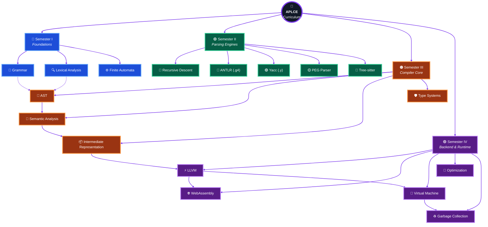
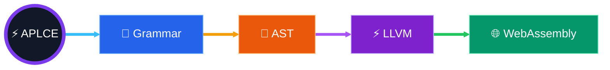
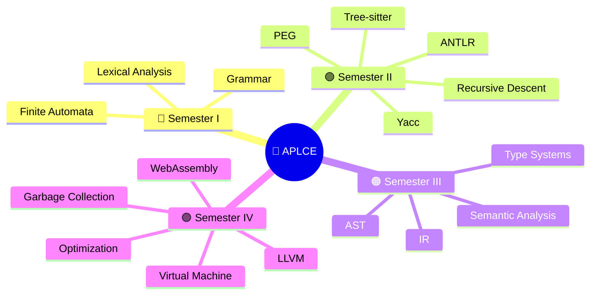
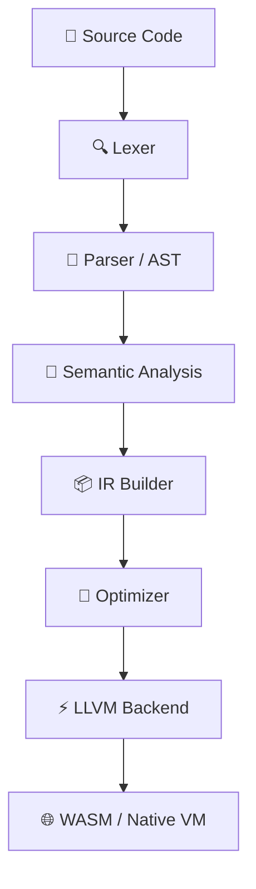
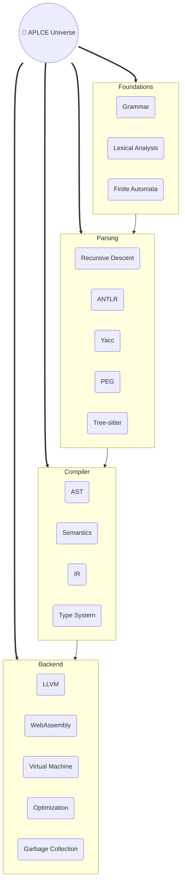

<p align="center">
  
</p>


# APLCE Curriculum — 3D Animated Roadmap


✨ GitHub Mermaid Animation Effects

GitHub Mermaid supports animated SVG edges.

Add this version for glowing animated paths:

🌌 APLCE 3D Semester Galaxy (Mermaid Mindmap)

🌠 APLCE Compiler Pipeline (3D Orbit Style)

🌍 APLCE Knowledge Universe

This is the version I’d use as the centerpiece of the repository.

💎 This is only Level 1 of APLCE

For your auraecosystem/APLCE repository, I can build a 1,500+ line README with:
```svg
* 🌌 Animated 3D Mermaid Campus Map.
* 🛰️ Interactive Compiler Pipeline.
* 🧠 AST Trees with Mermaid.
* ⚡ LLVM → WASM → VM animations.
* 🌍 Language Family Galaxy (200+ programming languages).
* 📚 8-semester curriculum (not just 4 semesters).
* 🎓 SVG neon diagrams, architecture maps, timelines, Gantt charts, Sankey flows, and GitHub-ready animations.
```
