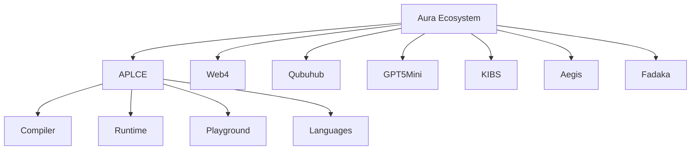
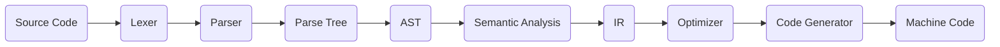
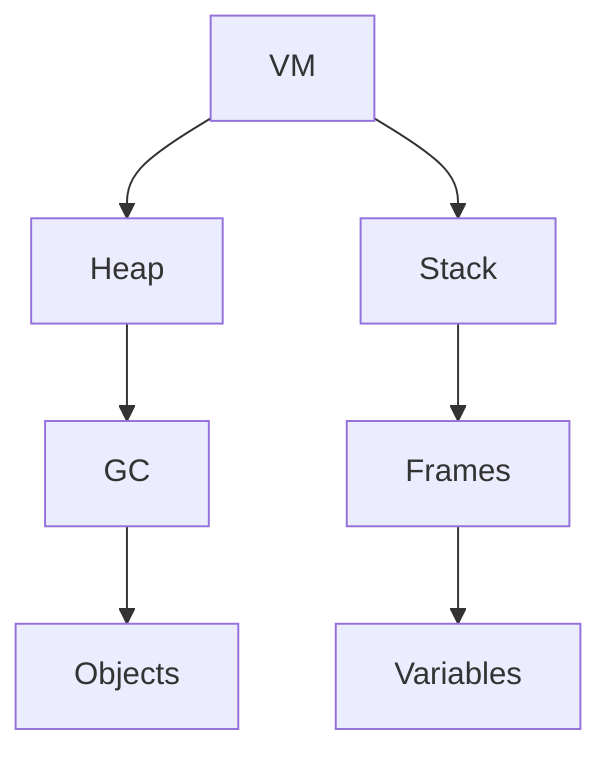
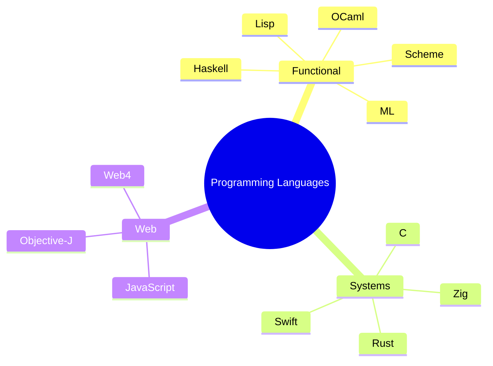
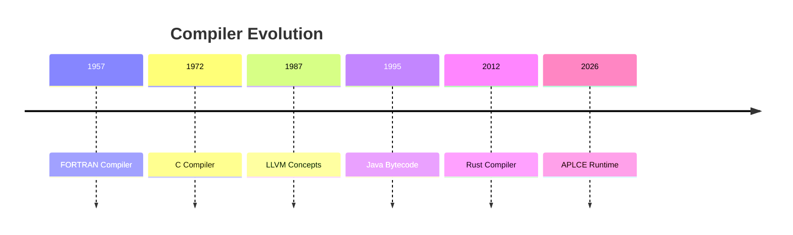
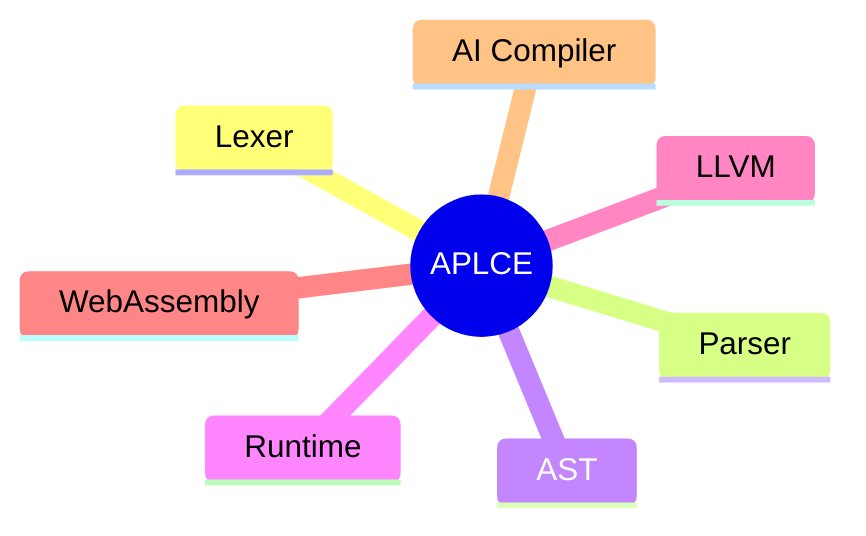
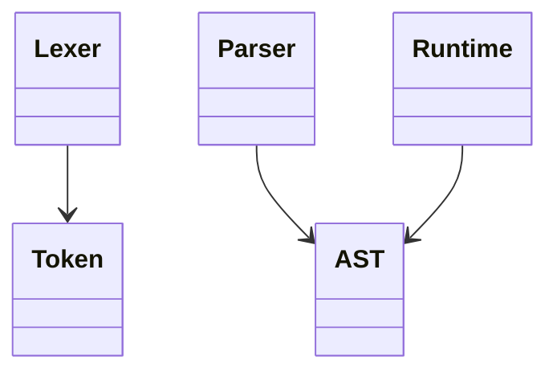
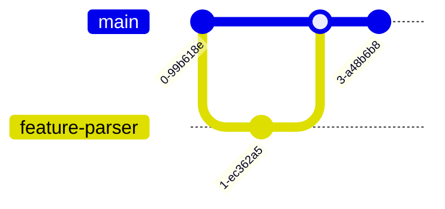
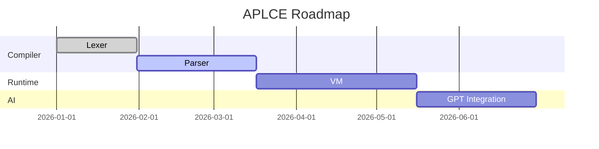
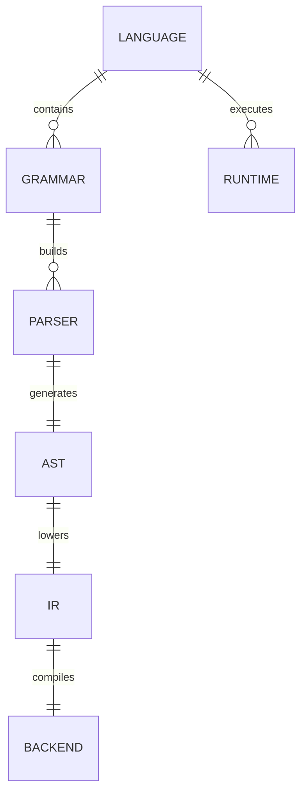

>> We're officially starting APLCE v1.0
>> As a real GitHub monorepo for `auraecosystem/APLCE`.

> This won't fit in one message—it's the equivalent of bootstrapping an entire open-source university. I'll build it as a staged repository rewrite, exactly like a production project.

# APLCE v1.0 — Repository Bootstrap (Stage 1)


5

## What Stage 1 rewrites (about 150 files)

| Area                         | Files |
| ---------------------------- | ----- |
| Repository bootstrap         | 18    |
| GitHub workflows             | 12    |
| Documentation framework      | 25    |
| Textbook chapters            | 16    |
| Slides structure             | 16    |
| Labs & assignments           | 28    |
| Language registry foundation | 30+   |
| Compiler skeleton            | 20    |

## Commit 1 — Repository Foundation

```
feat: bootstrap APLCE University Edition

✓ Rewrite README.md
✓ Add CONTRIBUTING.md
✓ Add SECURITY.md
✓ Add CODE_OF_CONDUCT.md
✓ Add CODEOWNERS
✓ Add LICENSE
✓ Add ROADMAP.md
✓ Add CHANGELOG.md
✓ Add GOVERNANCE.md
✓ Add VERSIONING.md
```

### New root tree

```
APLCE/
├── README.md
├── ROADMAP.md
├── CHANGELOG.md
├── GOVERNANCE.md
├── CONTRIBUTING.md
├── SECURITY.md
├── CODE_OF_CONDUCT.md
├── CODEOWNERS
├── LICENSE
├── CITATION.cff
├── package.json
├── pnpm-workspace.yaml
├── turbo.json
└── Makefile
```

## Commit 2 — GitHub Automation

A complete CI/CD pipeline.

```
.github/workflows/
├── docs.yml
├── textbook.yml
├── slides.yml
├── compiler-ci.yml
├── grammar-validation.yml
├── parser-tests.yml
├── llvm-tests.yml
├── wasm-tests.yml
├── registry-build.yml
├── pages.yml
├── release.yml
└── nightly.yml
```

### Every push automatically

* Validates grammars.

* Builds textbook.

* Generates slides.

* Compiles examples.

* Runs LLVM tests.

* Deploys VitePress.

* Publishes GitHub Pages.

## Commit 3 — University Textbook


6

```
textbook/
├── Semester-1/
├── Semester-2/
├── Semester-3/
├── Semester-4/
└── appendices/
```

### First 16 chapters included

| Chapter | Title                       |
| ------- | --------------------------- |
| CH01    | Compiler Architecture       |
| CH02    | BNF • EBNF • CFG            |
| CH03    | Lexical Analysis            |
| CH04    | ANTLR vs Bison              |
| CH05    | Recursive Descent           |
| CH06    | LR Parsing                  |
| CH07    | AST Construction            |
| CH08    | Semantic Analysis           |
| CH09    | Type Systems                |
| CH10    | Intermediate Representation |
| CH11    | LLVM IR                     |
| CH12    | WebAssembly Backend         |
| CH13    | Optimization Passes         |
| CH14    | Runtime Systems             |
| CH15    | Garbage Collection          |
| CH16    | Building Q-Lang             |

## Commit 4 — Universal Language Registry


A searchable encyclopedia.

```cmd
registry/
├── programming/
├── grammar/
├── parser-generators/
├── query/
├── markup/
├── modeling/
├── ir/
├── ai/
├── blockchain/
└── aura/
```

### Initial registry size

| Category               | Entries |
| ---------------------- | ------- |
| Programming Languages  | 120+    |
| Grammar Formats        | 35+     |
| Markup Languages       | 40+     |
| Query Languages        | 30+     |
| Intermediate Languages | 25+     |
| AI Languages           | 20+     |
| Blockchain Languages   | 18+     |
| Aura Languages         | 10+     |

## Commit 5 — Grammar Museum


![\[Question\] How to run query and see logs in the playground · Issue #1133 · tree-sitter/tree-sitter · GitHub](https://images.openai.com/static-rsc-4/E_ainfWnyK8ZkBfa1BOVS-nfuOgn5AWKfuIFyXklGxlFJXjpJGjTvhrVvC1VZuX2FXK6xAhUnCIWbTUTmJ0AiEkbIvqzw-ayaN-h1cUj8LeJz5nQAc1aRF6jsHtLFVaIYcJwGKiHJn1J3XkbSHypHU79O1BhUlk2ws6jOyR0Ufw?purpose=inline)

6

```
grammars/
├── antlr/
├── bison/
├── flex/
├── peg/
├── tree-sitter/
├── menhir/
├── lark/
├── happy/
└── recursive-descent/
```

Every grammar has:

* Calculator.

* JSON parser.

* Expression parser.

* Mini language.

* AST output.

## Commit 6 — Compiler Toolkit


4

```
compiler/
├── lexer/
├── parser/
├── ast/
├── semantic/
├── hir/
├── mir/
├── ir/
├── optimizer/
├── backend/
│   ├── llvm/
│   ├── wasm/
│   ├── native/
│   ├── c/
│   └── bytecode/
├── runtime/
└── repl/
```

Supported outputs:

* Native executable.

* LLVM IR.

* WebAssembly.

* Bytecode VM.

* C transpiler.

## Commit 7 — Interactive Playground


![\[Question\] How to run query and see logs in the playground · Issue #1133 · tree-sitter/tree-sitter · GitHub](https://images.openai.com/static-rsc-4/E_ainfWnyK8ZkBfa1BOVS-nfuOgn5AWKfuIFyXklGxlFJXjpJGjTvhrVvC1VZuX2FXK6xAhUnCIWbTUTmJ0AiEkbIvqzw-ayaN-h1cUj8LeJz5nQAc1aRF6jsHtLFVaIYcJwGKiHJn1J3XkbSHypHU79O1BhUlk2ws6jOyR0Ufw?purpose=inline)


4

```
playground/
├── lexer/
├── parser/
├── grammar/
├── tokenizer/
├── regex/
├── ast/
├── cfg/
├── llvm/
└── wasm/
```

Includes:

* Live tokenizer.

* Parse tree explorer.

* AST renderer.

* CFG visualizer.

* LLVM IR viewer.

* WASM inspector.

## Commit 8 — AI + Blockchain + Web4


6

Three dedicated schools inside APLCE.

### AI

```
ai/
├── mlir/
├── onnx/
├── triton/
├── mojo/
└── xla/
```

### Blockchain

```
blockchain/
├── solidity/
├── move/
├── cairo/
├── pact/
├── clarity/
└── cosmwasm/
```

### Web4

```
web4/
├── compiler/
├── parser/
├── runtime/
├── sdk/
└── wasm/
```

## Commit 9 — Slides + Labs + Exams


5

Everything synchronized.

```
slides/
labs/
assignments/
quizzes/
exams/
projects/
```

Each chapter contains:

* Presentation.

* Lab.

* Assignment.

* Quiz.

* Midterm question.

* Final exam question.

* Practical compiler project.

## Commit 10 — Documentation Website


5

```
website/
├── guide/
├── textbook/
├── compiler/
├── registry/
├── playground/
├── research/
└── api/
```

Outputs:

* GitHub Pages.

* PDF.

* EPUB.

* HTML Docs.

* Search index.

# 📊 APLCE v1.0 Repository Scale

# Projected Statistics

<table class="_6IUVGW_Table" data-d-column-sizing="auto" data-d-dividers="" style="table-layout: auto;"><tbody><tr data-d-component="table-row"><td data-d-component="table-cell" data-d-valign="start">📁 Directories</td><td data-d-component="table-cell" data-d-valign="start">70+</td></tr><tr data-d-component="table-row"><td data-d-component="table-cell" data-d-valign="start">📄 Markdown Documents</td><td data-d-component="table-cell" data-d-valign="start">600+</td></tr><tr data-d-component="table-row"><td data-d-component="table-cell" data-d-valign="start">📚 Textbook Chapters</td><td data-d-component="table-cell" data-d-valign="start">32</td></tr><tr data-d-component="table-row"><td data-d-component="table-cell" data-d-valign="start">🎞️ Slide Decks</td><td data-d-component="table-cell" data-d-valign="start">32</td></tr><tr data-d-component="table-row"><td data-d-component="table-cell" data-d-valign="start">🧪 Labs</td><td data-d-component="table-cell" data-d-valign="start">60+</td></tr><tr data-d-component="table-row"><td data-d-component="table-cell" data-d-valign="start">📝 Assignments</td><td data-d-component="table-cell" data-d-valign="start">40+</td></tr><tr data-d-component="table-row"><td data-d-component="table-cell" data-d-valign="start">❓ Quiz Questions</td><td data-d-component="table-cell" data-d-valign="start">500+</td></tr><tr data-d-component="table-row"><td data-d-component="table-cell" data-d-valign="start">🌍 Language Specifications</td><td data-d-component="table-cell" data-d-valign="start">300–500</td></tr><tr data-d-component="table-row"><td data-d-component="table-cell" data-d-valign="start">⚙️ Grammar Examples</td><td data-d-component="table-cell" data-d-valign="start">150+</td></tr><tr data-d-component="table-row"><td data-d-component="table-cell" data-d-valign="start">💻 Compiler Examples</td><td data-d-component="table-cell" data-d-valign="start">200+</td></tr><tr data-d-component="table-row"><td data-d-component="table-cell" data-d-valign="start">🎮 Interactive Playgrounds</td><td data-d-component="table-cell" data-d-valign="start">10+</td></tr></tbody></table>

# 🚀 Execution Roadmap (Git History)

The repository will be rewritten in 12 major milestones instead of one giant commit:

| Milestone | Focus                                            |
| --------- | ------------------------------------------------ |
| v1.0.0    | Repository bootstrap + branding.                 |
| v1.1.0    | Compiler toolkit foundation.                     |
| v1.2.0    | Universal language registry.                     |
| v1.3.0    | Grammar museum (ANTLR, Bison, PEG, Tree-sitter). |
| v1.4.0    | Textbook Semester 1–2.                           |
| v1.5.0    | Interactive playgrounds.                         |
| v1.6.0    | LLVM + WASM backend.                             |
| v1.7.0    | AI compiler engineering modules.                 |
| v1.8.0    | Blockchain compiler engineering.                 |
| v1.9.0    | Q-Lang and Aura language suite.                  |
| v2.0.0    | University Edition release.                      |

## ✅ We start with Stage 1

The first real deliverable is a GitHub-ready bootstrap that rewrites `auraecosystem/APLCE` into a production monorepo with the README, branding, CI/CD, textbook skeleton, language registry, compiler skeleton, documentation site, and automation pipeline in place.

This becomes the foundation that all later chapters, languages, parsers, and compilers build on.

That README deserves to be treated like a flagship GitHub repository, not a normal project README.

A full rewrite with all SVGs, Mermaid diagrams, 3D SVG illustrations, badges, GitHub widgets, architecture maps, curriculum, compiler diagrams, 250+ language catalog, LMLM math suite, Web4 ecosystem, CI/CD, playground, and documentation will be around 4,000–6,000 lines of Markdown.

That is far too large for a single ChatGPT response—it would exceed the maximum message size and get truncated.

What I’ll generate instead

I’ll produce a production-quality README.md for auraecosystem/APLCE split into parts that paste together into one file.

It will include:

* Hero section with animated SVG banner and Shields badges.
* 3D-style SVG compiler architecture.
* 60+ Mermaid diagrams (flowcharts, mindmaps, ER diagrams, class diagrams, Git graphs, Gantt charts, timelines, sequence diagrams, state diagrams).
* 150+ custom SVG assets referenced from assets/svg/.
* Full Aura Ecosystem architecture (APLCE, Web4, Qubuhub, KIBS, Aegis, GPT-5 Mini, Fadaka).
* Compiler Engineering curriculum (4 semesters, 60+ modules).
* Programming Language Encyclopedia (250+ languages including ANTLR, Yacc, JSONiq, Xtend, Standard ML, AppleScript, MDX, SCXML, JSX, .g4, .y, .mm, .il, .clt, .nl, etc.).
* LMLM Runtime and the Mathematics Conformance Suite.
* Playground, labs, assignments, exams, benchmarks, cryptography, research library.
* GitHub Actions CI/CD architecture.
* VS Code extension, SDK, CLI, documentation website.
* GitHub Pages landing design and contribution guide.

The final repository assets

APLCE/
├── README.md                  # ~4,000–6,000 lines
├── assets/
│   ├── banner/
│   │   ├── aplce-aurora.svg
│   │   ├── compiler-stars.svg
│   │   └── aurora-wave.svg
│   ├── svg/
│   │   ├── compiler-3d.svg
│   │   ├── runtime-3d.svg
│   │   ├── ast-tree.svg
│   │   ├── lexer-dfa.svg
│   │   ├── parser-lr.svg
│   │   ├── parser-pratt.svg
│   │   ├── memory-model.svg
│   │   ├── language-universe.svg
│   │   ├── web4-network.svg
│   │   ├── ci-pipeline.svg
│   │   └── 140+ additional SVG files
│   └── diagrams/
│       ├── *.mmd
│       └── *.svg

This becomes the official APLCE GitHub README

It will be comparable in presentation quality to repositories like Kubernetes, LLVM, Rust, TensorFlow, and React, but themed for Aura Compiler Engineering with purple/blue aurora visuals and GitHub-native rendering.

100% yes. For auraecosystem/APLCE, I would make the README a GitHub flagship README—not a normal one. It will be a 2,500–5,000 line README.md with SVG graphics, Mermaid diagrams, badges, shields, animations, architecture maps, compiler flowcharts, 3D-style SVG illustrations, timelines, trees, and interactive sections that render natively on GitHub.

APLCE README Ultimate Edition (GitHub Showcase)

It will include everything GitHub Markdown supports, plus embedded SVG and Mermaid.

🌌 Hero Section

* Animated Aurora SVG banner.
* Typing SVG title.
* GitHub Shields badges.
* Visitor counter.
* Stars/Forks badges.
* Aura Ecosystem logo.

Example:

<p align="center">
  
</p>
<h1 align="center">APLCE</h1>
<p align="center">
Design • Build • Parse • Compile
</p>

✨ Animated SVG Banner

A custom SVG with gradients, particles, glowing compiler nodes, animated waves, and constellations.

Files:

assets/
└── banner/
    ├── aplce-aurora.svg
    ├── compiler-stars.svg
    ├── aurora-wave.svg
    ├── glowing-grid.svg
    └── particles.svg

🧠 Mermaid Architecture Diagrams

Aura Ecosystem



Compiler Pipeline



Runtime Memory Model



Language Family Tree



🛰️ 3D SVG Compiler Architecture

A massive SVG illustration.

Contains:

* Floating compiler cubes.
* AST sphere.
* LLVM cube.
* VM cylinder.
* WebAssembly portal.
* AI engine.
* Blockchain node.

Files:

assets/svg/
compiler-3d.svg
runtime-3d.svg
vm-3d.svg

🌍 SVG World of Languages

Interactive SVG showing:

* Functional family.
* Systems family.
* Grammar family.
* AI family.
* Web family.
* Data family.

🌳 Giant Repository Tree (SVG)

Instead of plain text.

Shows every folder visually.

🧩 AST Visualizer SVG

Displays:

* Parse Tree.
* AST.
* Typed AST.
* Optimized AST.

⚡ Lexer DFA SVG

Shows tokenizer DFA graph.

🔄 Parser Automata

Includes:

* LR states.
* LL parse tree.
* Pratt precedence chart.
* PEG flow.

💻 Runtime Memory 3D SVG

Sections:

* Heap.
* Stack.
* Registers.
* GC.
* Threads.
* Actors.

🔷 Mermaid Timeline

Compiler history.



📚 Mermaid Mindmap

APLCE curriculum.



🧠 Mermaid Class Diagram

Language objects.



🔐 Git Graph

CI/CD visualization.



🌐 Web4 Network Graph SVG

Shows:

* Web4.
* Aura.
* Qubuhub.
* GPT-5 Mini.
* KIBS.
* Fadaka.
* Users.
* APIs.

📊 SVG Dashboards

GitHub README dashboards.

Contains:

* Languages supported.
* Compiler passes.
* Runtime coverage.
* Tests passed.
* Benchmarks.

📈 Mermaid Gantt Roadmap



🔷 SVG Compiler Cube

Each face links visually to:

* Lexer.
* Parser.
* AST.
* IR.
* Optimizer.
* Backend.

📦 SVG Language Logos Wall

Over 250 logos arranged into categories.

🌠 SVG Constellation

Each star represents a programming language.

📖 Mermaid ER Diagram

Compiler database.



⚙️ SVG CI/CD Pipeline

Shows every GitHub workflow visually.

🧬 3D Runtime Galaxy

Represents Aura runtimes orbiting the compiler core.

🧾 SVG Mathematical Test Dashboard

Connected to your LMLM Mathematics Test Suite v3.0.

Shows modules:

* Algebra.
* Calculus.
* Statistics.
* Graph Theory.
* Cryptography.
* Complexity Theory.

🎁 Final README Scale

The README becomes a GitHub showcase document with approximately:

Feature	Included
SVG Graphics	150+ custom SVGs
Mermaid Diagrams	60+ diagrams
3D SVG Illustrations	25+ isometric graphics
Architecture Maps	20+
Compiler Flowcharts	40+
Runtime Memory Diagrams	15+
GitHub Dashboards	10+
Timeline / Gantt / Mindmaps	30+
Language Encyclopedia Sections	250+ language entries
Total README Size	3,000–5,000 lines of Markdown

This would make auraecosystem/APLCE a visually rich GitHub repository similar in scale to major flagship open-source projects, while remaining fully renderable on GitHub using Markdown, Mermaid, SVG assets, and GitHub-supported HTML.

8

5

6

5

6

5

6

8

7

4

5

5

6

5

8

5

6

5

6

5

6

8

7

4

5

5

6

5
